# 🍽️ Yummy Food Review

## 📖 Project Overview

**Yummy** is a food review platform for restaurants in **Addis Ababa, Ethiopia**, connecting diners and restaurants through a **user-friendly interface**.  
This prototype serves as a **proof of concept**, with some integrations not fully production-ready. 🌟

🔗 **Project URL:** [yummy-eatery.netlify.app](https://yummy-eatery.netlify.app)

---

## 🖼️ Website Image Gallery

Below are preview images used throughout the Yummy Eatery website. These visuals represent key sections and features of the platform.

<table>
  <tr>
    <td align="center"><b>About Section 1</b> </td>
    <td align="center"><b>About Section 2</b> 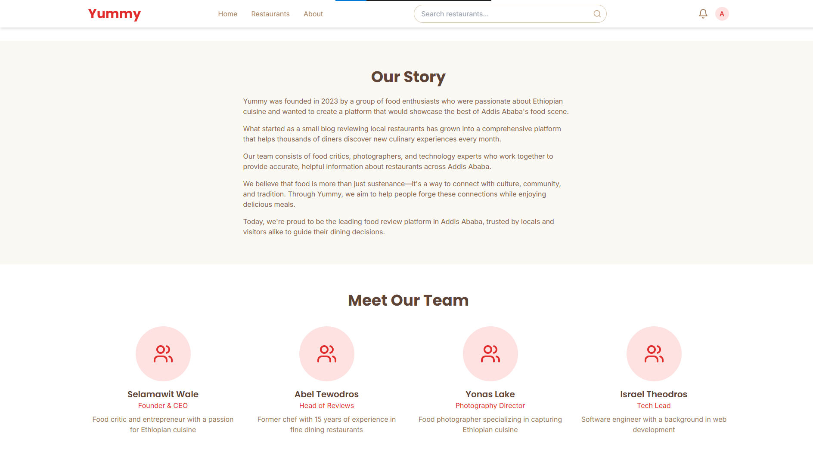</td>
  </tr>
  <tr>
    <td align="center"><b>Admin Dashboard</b> 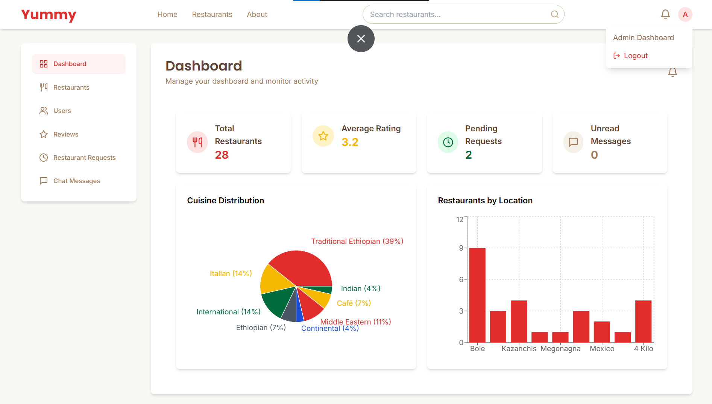</td>
    <td align="center"><b>Admin Restaurants</b> 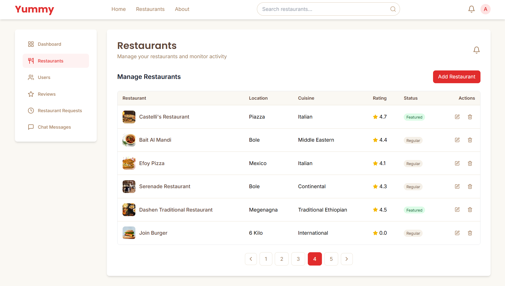</td>
  </tr>
  <tr>
    <td align="center"><b>Admin Reviews</b> 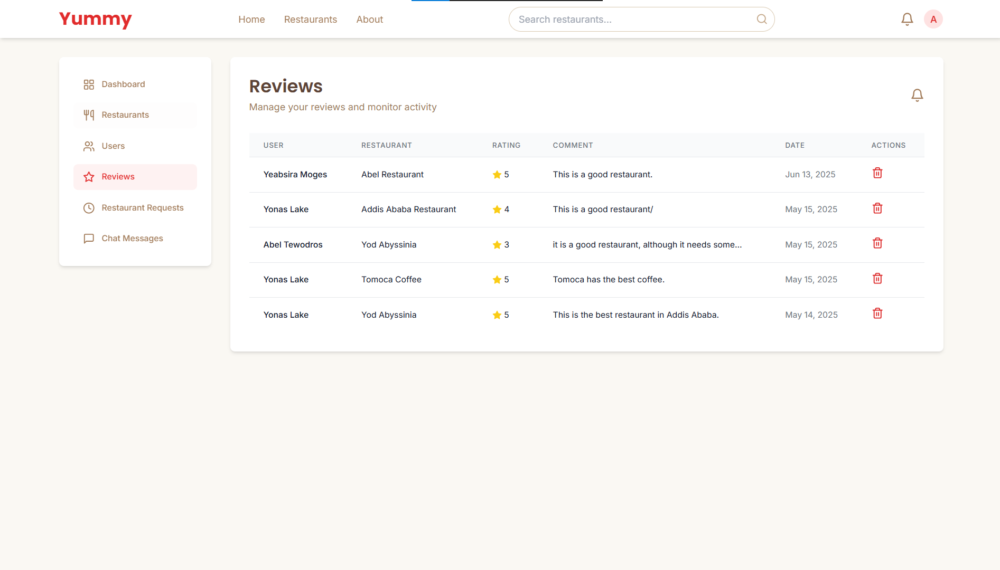</td>
    <td align="center"><b>Admin Users</b> 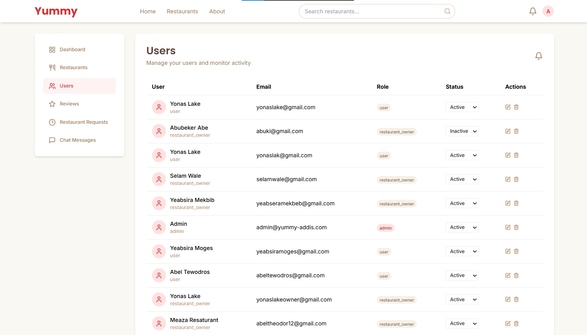</td>
  </tr>
  <tr>
    <td align="center"><b>Admin Chat 1</b> 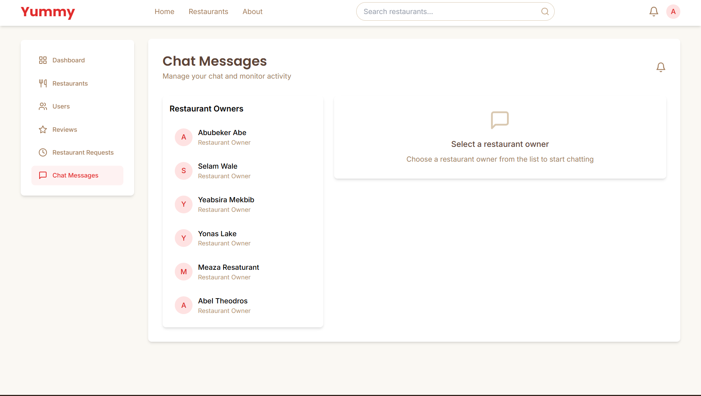</td>
    <td align="center"><b>Admin Chat 2</b> 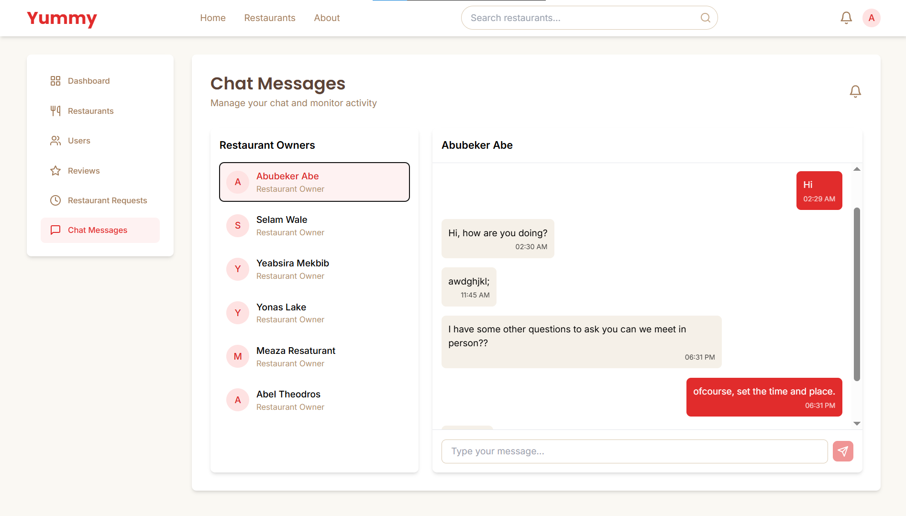</td>
  </tr>
  <tr>
    <td align="center"><b>Admin Request 1</b> 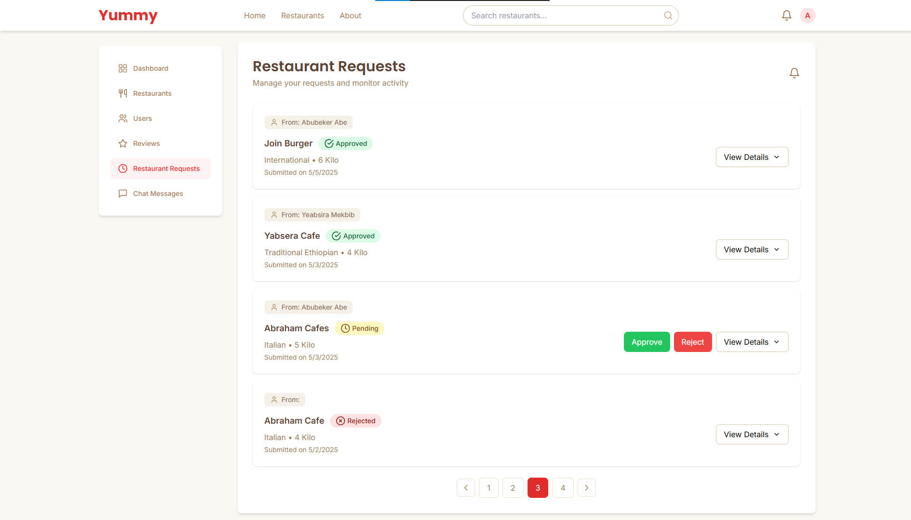</td>
    <td align="center"><b>Admin Request 2</b> 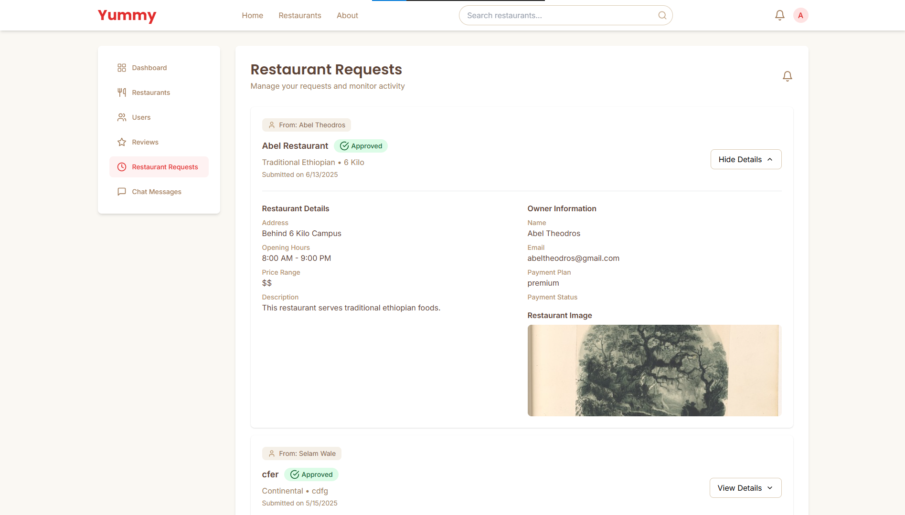</td>
  </tr>
  <tr>
    <td align="center"><b>Restaurants Section</b> 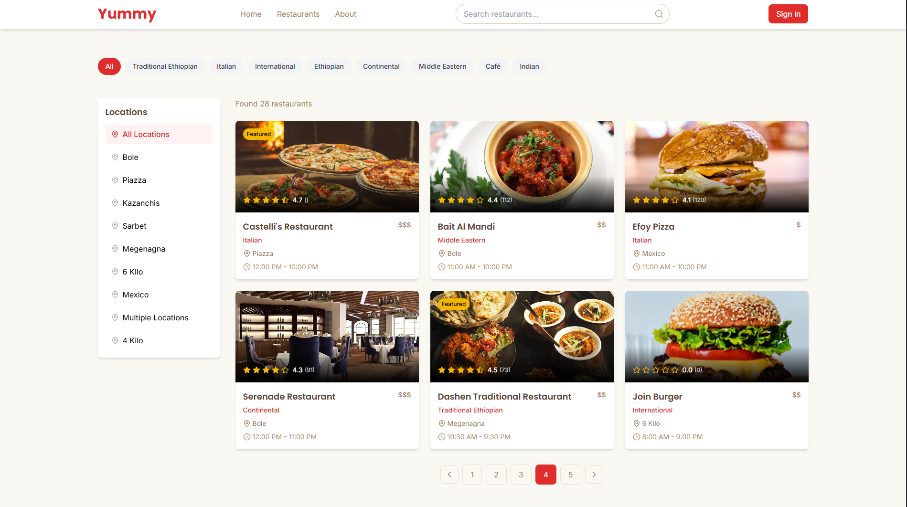</td>
    <td align="center"><b>Sign In</b> 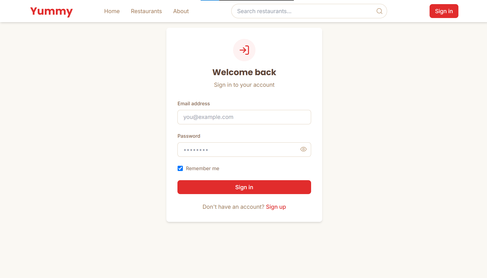</td>
  </tr>
  <tr>
    <td align="center"><b>Sign Up</b> 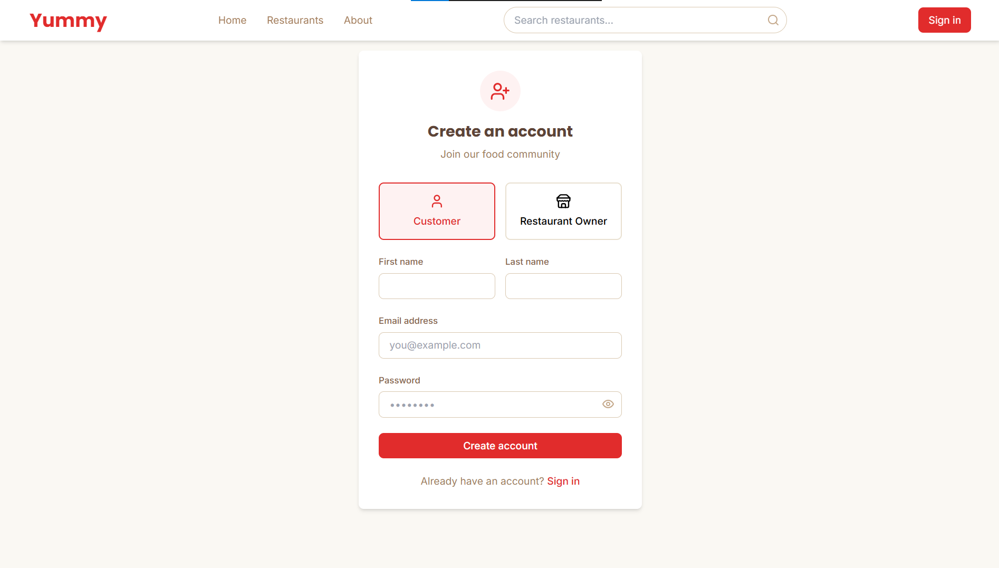</td>
    <td></td>
  </tr>
</table>

## ✨ Key Features

### 🔐 User Authentication & Authorization

- Secure email-based authentication 📧  
- Roles: **Customer**, **Restaurant Owner**, **Admin** 👥  
- Protected routes by permissions 🚪  

### 🍴 Restaurant Discovery

- Advanced search and filtering by **cuisine** and **location** 🔍  
- Interactive restaurant cards and profiles 🖼️  

### ⭐ Review System

- Star-based ratings and written reviews ✍️  
- User review management and admin moderation 🛡️  

### 🍴 Restaurant Owner Features

- Restaurant registration and dashboard 📋  
- Real-time admin chat 💬  
- Payment integration for listings 💳  

### 📊 Admin Dashboard

- Restaurant and user management 🛠️  
- Review moderation and analytics 📈  

### 😊 User Features

- Profile management  
- Saved restaurants  
- Review history  
- Notifications 🔔  

---

## 🛠️ Technical Implementation

### 🌐 Frontend

- React 18 with TypeScript ⚛️  
- Tailwind CSS, Framer Motion, Lucide React, React Router 🎨  

### ⚙️ Backend

- Firebase Authentication, Firestore Database 🔥  
- Cloudinary for images 🖼️  

### 🔒 Security

- Row Level Security (RLS) 🛡️  
- Protected APIs, secure payments, data validation ✅  

### 🚀 Performance

- Lazy loading  
- Image optimization  
- Caching  
- Optimized queries ⚡  

---

## 🎓 Educational Value

- **Architecture & Design:** MVC, modular components, responsive design, state management  
- **Security:** Authentication, authorization, data protection, secure payments  
- **Database:** Relational and NoSQL modeling, migrations, data integrity  
- **User Experience:** Intuitive navigation, responsive UI, real-time updates  
- **APIs:** RESTful design, WebSocket, third-party integrations  

---

## 💼 Business Benefits

### For Restaurants 🍴

- Increased visibility  
- Feedback management  
- Analytics 📈  

### For Customers 😊

- Easy discovery  
- Trusted reviews  
- Personalized experience 🌟  

### For Admins ⚙️

- Centralized management  
- Quality control  
- Revenue generation 💰  

---

## 🚀 Future Enhancements

### 🔧 Technical

- Mobile app  
- Advanced search  
- AI recommendations  
- Optimizations  

### ✨ Features

- Table reservations  
- Loyalty programs  
- Menu management  
- Order tracking  

### 🌍 Business

- Multi-city support  
- Internationalization  
- Advanced analytics  
- Marketing  

---

## 🏁 Conclusion

**Yummy** showcases a **scalable**, **secure**, and **user-friendly** platform for restaurant discovery and reviews in **Addis Ababa**.  
This prototype demonstrates **modern web development practices** and **real-world business solutions**. 🎉

---

